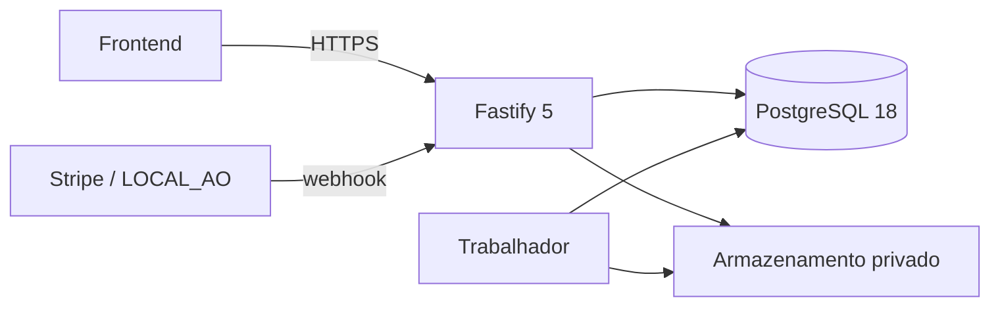

# 01 — Fundamentos e stack

> **Decisão:** a Entrela começa como um monólito modular. É uma só plataforma, um só backend e uma só base de dados para as seis categorias.



## Stack adoptada

- **Node.js 24 LTS** como runtime.
- **TypeScript** com `strict: true`; código sem `any` implícito.
- **Fastify 5** para HTTP.
- **Zod 4** com `fastify-type-provider-zod`; o mesmo schema valida pedido, resposta e documentação.
- **OpenAPI/Swagger** gerado dos schemas e exposto em `/documentacao`.
- **PostgreSQL 18**, actualizado para a última versão menor disponível. O processo de entrega regista o digest exacto da imagem em cada publicação.
- **Drizzle ORM** para consultas, transacções e relações do domínio.
- **Drizzle Kit** para gerar migrações SQL que são revistas e guardadas no repositório.

## Regra de dados

Drizzle é o caminho normal de escrita e leitura de domínio. SQL directo é permitido somente em `src/repository/relatorios/`, para análises ou agregações que Drizzle não expresse com clareza. Essas consultas são sempre:

- de leitura;
- parametrizadas;
- isoladas do fluxo público;
- testadas com um volume de dados realista.

## Fronteira de responsabilidade

```text
frontend → rota Fastify → caso de uso → domínio → Drizzle/PostgreSQL
```

O frontend nunca decide se uma experiência abriu, qual bloco revelar, se um ficheiro está pronto ou se um pagamento concede um direito. Essas decisões pertencem a casos de uso no backend.

## Pronto quando

- [ ] O `package.json` declara exactamente a stack acima.
- [x] O arranque falha de forma clara se faltar configuração obrigatória. [Evidência](../implementacoes/001-fundacao-http-e-configuracao.md)
- [x] `/saude` responde sem autenticação e sem consultar conteúdo privado. [Evidência](../implementacoes/001-fundacao-http-e-configuracao.md)
- [x] `/documentacao` mostra a OpenAPI gerada a partir dos schemas Zod. [Evidência](../implementacoes/001-fundacao-http-e-configuracao.md)
