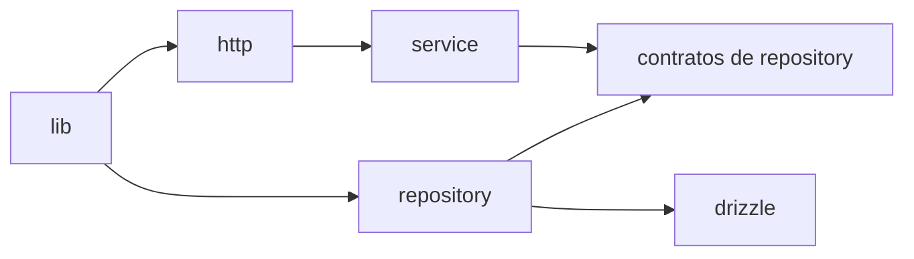

# 02 — Organização do código

> **Decisão:** as camadas técnicas usam a estrutura fixa abaixo. Os nomes de domínio, classes, métodos, funções e ficheiros próprios da Entrela permanecem em português.

```text
backend/
  drizzle/                    # schema e migrações da base de dados
  src/
    app.ts                    # composição Fastify
    server.ts                 # entrada do processo
    http/
      controllers/            # adaptação entre HTTP e casos de uso
      routes/                 # registo das rotas Fastify
      schemas/                # contratos Zod e OpenAPI
    service/                  # casos de uso
      utils/                  # algoritmos partilhados entre casos de uso
      errs/                   # erros tipados de aplicação
    repository/               # contratos e integrações de persistência
    lib/                      # configuração e integrações técnicas comuns
  package.json
  drizzle.config.ts             # criado com o primeiro schema validado
```

## Organização dos casos de uso

```text
src/service/
  criar-momento.ts
  criar-momento.spec.ts
  publicar-momento.ts
  publicar-momento.spec.ts
  utils/
  errs/
```

O teste unitário de cada caso de uso fica na mesma pasta e usa o mesmo nome com `.spec.ts`. Quando uma categoria crescer, pode receber uma subpasta própria dentro de `service`, mantendo teste e implementação juntos.

## Organização dos repositórios

```text
src/repository/
  contratos/                 # interfaces consumidas pelos services
  drizzle/                   # implementações PostgreSQL/Drizzle
  em-memoria/                # implementações para testes
  relatorios/                # SQL analítico directo e somente leitura
```

## Direcção de dependências



- `http` conhece Fastify e Zod, mas não contém SQL ou regra de negócio.
- `service` contém casos de uso e depende de contratos, nunca de Drizzle ou Fastify.
- `repository` concentra toda integração com PostgreSQL e outros mecanismos de persistência.
- `lib` contém configuração e clientes técnicos partilhados, sem se tornar depósito de regras de negócio.
- `app.ts` compõe as dependências; `server.ts` apenas inicia o processo.
- `drizzle/` não contém controladores, services ou lógica de apresentação.

## Primeiros casos de uso

`CriarMomento`, `ActualizarRascunhoDoMomento`, `PublicarMomento`, `ResolverPontoDeAcesso`, `AbrirMomento`, `ContinuarMomento`, `CriarAutorizacaoDeEnvioDeFicheiro` e `SolicitarRecordacao`.

`service/utils` é uma excepção estrutural pedida para algoritmos realmente partilhados. Não criar `helpers`, `common`, `manager` nem colocar em `utils` funções utilizadas por um único caso de uso.

## Pronto quando

- [x] A fundação está organizada em `http`, `service`, `repository` e `lib`, com o primeiro service testado ao lado da implementação. [Evidência](../implementacoes/002-caso-de-uso-criar-momento.md)
- [x] Os testes executam sem iniciar uma porta ou os módulos futuros. [Evidência](../implementacoes/001-fundacao-http-e-configuracao.md)
