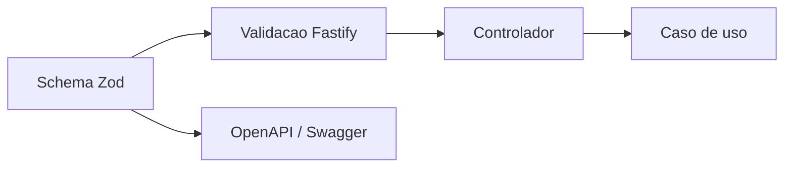

# 03 — API e contratos

> **Decisão:** Zod 4 é a fonte de verdade do contrato HTTP. Fastify 5 valida os pedidos e gera OpenAPI/Swagger a partir desses mesmos schemas.



## Grupos de rotas do MVP

- `/v1/autenticacao/*` — entrada de criador e gestão de sessão.
- `/v1/momentos/*` — rascunho, media, pré-visualização, publicação e painel.
- `/momento/:token/*` — resolver, abrir, continuar e solicitar recordação sem conta.
- `/v1/webhooks/*` — recepção autenticada de pagamentos; não é exposta ao frontend.

As rotas exactas e o comportamento de Momentos continuam no [MVP](../entrela-mvp-momentos-v1.md). A OpenAPI gerada é a referência navegável de campos, exemplos e respostas.

## Envelope único

```json
{
  "dados": {},
  "metadados": { "idDaRequisicao": "uuid", "versaoDaAPI": "v1" }
}
```

```json
{
  "erro": {
    "codigo": "VALIDACAO_FALHOU",
    "mensagem": "Não foi possível publicar o Momento.",
    "campos": [{ "caminho": "etapas[0]", "codigo": "OBRIGATORIO" }],
    "idDaRequisicao": "uuid"
  }
}
```

## Regras de contrato

- Escritas usam `Idempotency-Key`; repetição devolve o resultado anterior, não duplica efeito.
- Edição de rascunho usa `ETag` e `If-Match`; conflito devolve `412`.
- O frontend não envia `negocioId`, preço, direito, estado final de pagamento ou estado final de ficheiro como decisão.
- `GET /momento/:token` não cria métricas nem revela etapas privadas.
- `POST /momento/:token/continuar` aceita intenção limitada; o backend decide o próximo bloco.

## Pronto quando

- [ ] Toda rota tem schemas de pedido, resposta e erro.
- [x] A documentação OpenAPI muda automaticamente quando um schema Zod muda. [Evidência](../implementacoes/001-fundacao-http-e-configuracao.md)
- [ ] Controladores só adaptam HTTP; regras ficam nos casos de uso.
