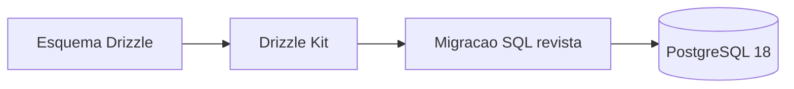

# 04 — Dados e migrações

> **Decisão:** o [esquema SQL canónico](../entrela-esquema-v1.sql) descreve o domínio. Drizzle ORM mapeia-o para TypeScript e as migrações SQL versionadas evoluem-no sem recriar dados existentes.

## O que já é canónico

`utilizadores`, `negocios`, `experiencias`, `versoes_da_experiencia`, `blocos`, `regras`, `pontos_de_acesso`, `sessoes_de_interacao`, `eventos_de_interacao`, `pagamentos` e `direitos` já têm nomes e invariantes definidos. Não criar uma segunda tabela equivalente em outro módulo.

## Adendas obrigatórias antes do MVP

As primeiras migrações acrescentam apenas dados operacionais que o esquema ainda não cobre:

- `desafios_de_autenticacao` e `sessoes_de_autenticacao`;
- `operacoes_idempotentes`;
- `sessoes_de_pre_visualizacao`;
- `tarefas_assincronas` e `solicitacoes_de_recordacao`;
- estado técnico e variantes de `ficheiros`;
- versão fixada em sessão/ponto de acesso para preservar a experiência publicada.

O detalhe de cada coluna pertence à migração revista e ao schema Drizzle, não a uma cópia longa neste MD.

## Regras de persistência

- Cada mutação de domínio decorre numa transacção Drizzle.
- Migrações entram em `backend/drizzle/migrations/` com número, descrição e metadados versionados pelo Drizzle Kit.
- Uma migração já aplicada nunca é alterada; uma correcção cria outra migração.
- PostgreSQL aplica RLS por `negocio_id`; o contexto é definido pelo backend dentro da transacção.
- Versões `PUBLICADA`, eventos e auditoria são imutáveis.

## Pronto quando

- [ ] Uma base vazia sobe apenas com as migrações do repositório.
- [ ] Um negócio não consegue ler nem alterar dados de outro.
- [ ] O mesmo evento ou pagamento repetido não cria dois efeitos.
