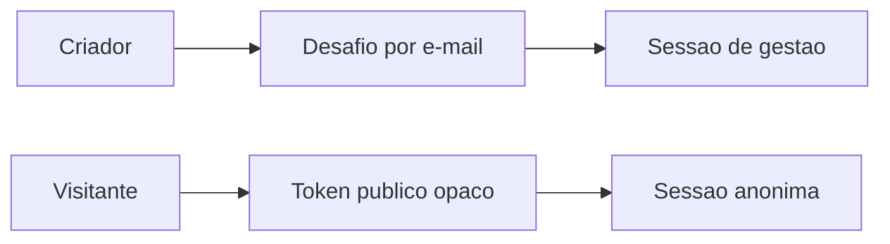

# 05 — Identidade e acesso

> **Decisão:** o criador entra por e-mail com desafio de uso único; o destinatário abre um Momento sem conta. As duas experiências usam sessões distintas e seguras.

## Criador

Após confirmar o desafio, o backend cria ou encontra `Utilizador`, verifica o e-mail e, no primeiro acesso, cria `Negocio(tipo=PESSOAL)` e `MembroDoNegocio(papel=PROPRIETARIO)`. A sessão usa cookies `HttpOnly`, `Secure`, `SameSite=Lax` e protecção CSRF.

Os papéis `PROPRIETARIO`, `ADMINISTRADOR`, `EDITOR`, `ANALISTA`, `FATURACAO` e `OPERADOR` são lidos apenas de `membros_do_negocio`. A política de acesso decide cada acção; o controlador não compara papéis directamente.

## Destinatário e ponto de acesso

- Link e QR carregam somente um token opaco de alta entropia.
- PostgreSQL guarda HMAC do token; token bruto não entra em logs nem auditoria.
- QR e URL são portas distintas para medir origem, mas chegam à mesma versão publicada.
- `GET` público não cria sessão ou evento. Só o gesto explícito em `POST /abrir` cria/retoma a sessão anónima.
- Sessão pública fica presa à versão que a pessoa abriu; publicar outra versão depois não altera a revelação em curso.

## Isolamento

Cada pedido autenticado recebe um `ContextoDePedido` com utilizador, negócio, papéis e ID de requisição. O backend define o contexto da transacção; o navegador nunca escolhe um negócio por cabeçalho ou corpo livre.

## Pronto quando

- [ ] Um token público inválido não revela conteúdo ou diferença útil de estado.
- [ ] Um `ANALISTA` não publica nem regenera portas; `EDITOR` só executa as acções editoriais previstas na política central.
- [ ] Um visitante consegue continuar a mesma experiência sem conta e sem alterar a hora do telemóvel.
