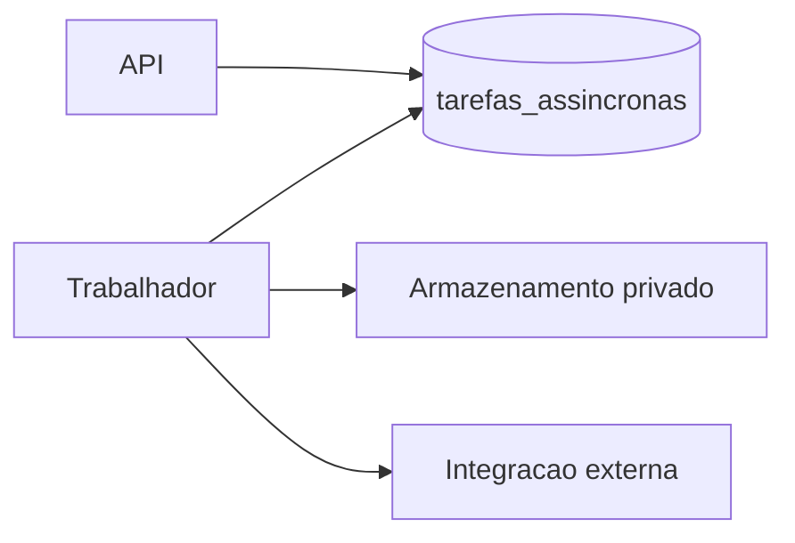

# 06 — Processamentos e integrações

> **Decisão:** tarefas lentas são duráveis e assíncronas. A resposta HTTP nunca espera por vídeo, PDF, QR, e-mail ou fornecedor de pagamento.

## Ficheiros e recordações

1. O backend autoriza o envio e cria `Ficheiro` privado.
2. O navegador envia directamente ao armazenamento temporário.
3. Um trabalhador verifica tamanho, tipo real, soma, segurança e gera derivados.
4. Só um ficheiro `PRONTO` pode ser publicado; a recordação é gerada e entregue por URL assinada curta.

O armazenamento é compatível com S3 e nunca público. Imagens removem metadados sensíveis; vídeos e áudios são processados fora do processo HTTP.

## Motor de regras

O motor descrito em [entrela-motor-de-regras-v1.md](../entrela-motor-de-regras-v1.md) continua a ser único para todas as categorias. No MVP, `GeradorDeManifestoDeMomentos` cria regras lineares; o criador não edita JSON de regras.

Para cada continuação, o backend grava o evento, avalia regras permitidas, actualiza progresso e devolve a projecção segura na mesma transacção. A chave de idempotência impede dois desbloqueios por dois toques.

## Pagamentos e direitos

No piloto, `Direito(tipo=PUBLICAR_MOMENTO)` pode ser atribuído internamente e auditado. Quando checkout entrar, `AdaptadorStripe` e `AdaptadorLocalAo` seguem a mesma interface. Só webhook autenticado confirma pagamento e concede direito; retorno do navegador nunca publica por si.

`LOCAL_AO` mantém-se um adaptador sem fornecedor inventado até existir parceiro angolano homologado.

## Pronto quando

- [ ] Reiniciar o trabalhador não duplica uma tarefa ou recordação.
- [ ] Um ficheiro pendente/falhado impede publicação.
- [ ] Um webhook repetido concede no máximo um direito.
