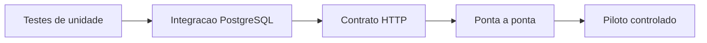

# 07 — Qualidade e entrega

> **Decisão:** uma funcionalidade só está pronta quando comportamento, segurança e operação foram verificados; build verde não basta.

## Caminho de implementação

1. Base Fastify, Zod, Drizzle, configuração, saúde e migrações.
2. Entrada de criador, negócio pessoal, papéis e RLS.
3. Rascunho de Momentos, blocos e ficheiros privados.
4. Publicação, link/QR, abertura temporal e sessão anónima.
5. Continuação idempotente, painel agregado e recordação.
6. Integrações de pagamento depois de o piloto validar Momentos.

## Testes indispensáveis

- outro negócio não lê, edita, publica ou associa ficheiro alheio;
- antes de `abre_em`, nenhuma rota, preview social ou media revela uma etapa;
- dois pedidos de continuação repetidos desbloqueiam uma só etapa;
- pré-visualização não cria métricas de produção;
- token revogado, upload inválido e webhook repetido falham de modo seguro;
- migrar uma base vazia e actualizar uma base anterior funcionam de forma reproduzível.

## Operação mínima

Logs estruturados ocultam tokens, e-mail, telefone, conteúdo e URLs assinadas. Há cópia de segurança cifrada, teste de restauro, limites de taxa, alerta para falhas de webhook/processamento e rotação de segredos.

## Pronto para piloto quando

- [ ] O fluxo completo funciona em navegador móvel e desktop.
- [ ] Testes de isolamento, idempotência e abertura programada passam.
- [ ] A OpenAPI, as migrações e a configuração representam o código realmente em execução.
- [ ] A equipa consegue restaurar uma cópia de segurança num ambiente de teste.
