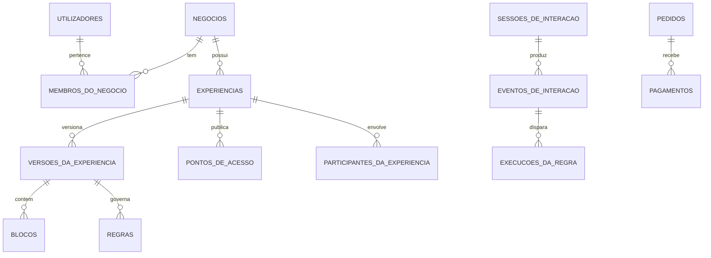

# Entrela — Especificação de domínio e dados (esquema-primeiro)

**Versão:** 1.1  
**Estado:** canónico para implementação  
**Idioma de código:** português, sem acentos nos identificadores.  
**Âmbito:** Empresas, Eventos, Momentos, Presentes, Convites e Experiências.

---

## 1. Decisões estruturais

1. A Entrela é uma plataforma única. As seis categorias são submarcas e conjuntos de capacidades, nunca aplicações, negócios ou bases de dados separados.
2. A experiência tem uma só `categoria`. Uma jornada que passa por Momentos, Presentes e Convites cria experiências relacionadas, em vez de mudar a categoria de uma experiência publicada.
3. O tenant/dono técnico é sempre `negocio_id`. Uma pessoa cria um negócio `PESSOAL`; empresas, agências e parceiros usam negócios próprios.
4. O destinatário público não cria conta. Conta é necessária para criar, gerir ou operar.
5. Conteúdo público vem somente de `versoes_da_experiencia` publicadas e imutáveis. Rascunho nunca é público.
6. A interface nasce em `pt-AO` e `en`. O modelo suporta conteúdo localizável, sem tradução automática de conteúdo pessoal.
7. Pagamentos usam adaptadores: `STRIPE` e `LOCAL_AO`. O método local concreto entra apenas depois de contratado e homologado.

O contrato SQL completo e executável está em [entrela-esquema-v1.sql](./entrela-esquema-v1.sql). As regras de escrita estão em [convenções de nomenclatura](./convencoes-de-nomenclatura.md).

---

## 2. Mapa do domínio

| Contexto | Responsabilidade | Tabelas nucleares |
|---|---|---|
| Identidade e pertença | Quem cria e a que negócio pertence | `utilizadores`, `negocios`, `membros_do_negocio` |
| Autoria e publicação | Experiência, versões, blocos e ficheiros | `experiencias`, `versoes_da_experiencia`, `blocos`, `ficheiros` |
| Acesso e audiência | Quem entra e em que contexto | `participantes_da_experiencia`, `concessoes_de_acesso`, `sessoes_de_interacao` |
| Motor | Tempo, regras, progresso e efeitos | `politicas_de_disponibilidade`, `regras`, `execucoes_da_regra` |
| Pontos físicos | QR, NFC, objectos e locais | `pontos_de_acesso`, `ancoras_fisicas`, `objetos_fisicos`, `locais` |
| Comércio | Pedido, pagamento, direito e reembolso | `pedidos`, `pagamentos`, `direitos`, `reembolsos` |
| Observabilidade | Factos de utilização e operações administrativas | `eventos_de_interacao`, `registos_de_auditoria` |

---

## 3. Convenções de dados

| Convenção | Regra |
|---|---|
| Chaves | `id uuid`, preferencialmente UUIDv7 gerado antes da inserção. |
| Datas | `timestamptz`, persistido em UTC. Cada negócio/experiência guarda `fuso_horario` IANA. |
| Dinheiro | Inteiro em unidade mínima e `moeda char(3)` ISO 4217. |
| Configuração | `jsonb` só para configuração validada de blocos, regras e snapshots. |
| Dados sensíveis | Contactos, tokens e dados de provedores guardados cifrados ou em HMAC. |
| Auditoria | Eventos e registos são append-only; métricas são projecções. |
| Isolamento | Todo dado do cliente deriva do mesmo `negocio_id`; RLS e serviço impedem cruzamento de negócios. |

---

## 4. Entidades fundamentais

### 4.1 Identidade e negócio

| Tabela | Classe | Campos determinantes | Regra |
|---|---|---|---|
| `utilizadores` | `Utilizador` | `email`, `telefone_e164`, `nome_de_apresentacao`, `idioma_preferido`, `estado` | Pelo menos e-mail ou telefone. |
| `negocios` | `Negocio` | `tipo`, `nome_de_apresentacao`, `identificador_publico`, `fuso_horario` | É o owner/tenant de tudo. |
| `membros_do_negocio` | `MembroDoNegocio` | `negocio_id`, `utilizador_id`, `papel`, `estado` | Nunca remover o último `PROPRIETARIO` ativo. |
| `perfis_de_negocio` | `PerfilDeNegocio` | dados legais cifrados, faturação, marca | Extensão do negócio empresarial. |
| `relacoes_entre_negocios` | `RelacaoEntreNegocios` | fornecedor, cliente, tipo, período | Agência e parceiro não se tornam donos do cliente. |

### 4.2 Experiência e publicação

| Tabela | Classe | Campos determinantes | Regra |
|---|---|---|---|
| `experiencias` | `Experiencia` | `negocio_id`, `categoria`, `estado`, `modo_de_acesso`, versões actual/publicada | A categoria não muda depois de publicação ou participação. |
| `versoes_da_experiencia` | `VersaoDaExperiencia` | `experiencia_id`, `numero`, `estado`, checksum | Versão `PUBLICADA` é imutável. |
| `traducoes_da_experiencia` | `TraducaoDaExperiencia` | experiência, idioma, título, resumo | Só `pt-AO` e `en` no lançamento. |
| `nos_da_experiencia` | `NoDaExperiencia` | versão, chave, tipo, posição | Etapa, cena, sala ou ponto de interesse. |
| `blocos` | `Bloco` | versão, chave, tipo, posição, visibilidade | Unidade renderizável, referenciada pelas regras. |
| `traducoes_do_bloco` | `TraducaoDoBloco` | bloco, idioma, conteúdo | Todo bloco visível tem fallback no idioma predefinido. |
| `ficheiros` / `ficheiros_do_bloco` | `Ficheiro` | armazenamento, MIME, tamanho, moderação | Ficheiro privado recebe URL assinada apenas após autorização. |

### 4.3 Tempo, regras e interacção

| Tabela | Classe | Campos determinantes | Regra |
|---|---|---|---|
| `politicas_de_disponibilidade` | `PoliticaDeDisponibilidade` | `abre_em`, `expira_em`, fuso, modo | Hora do servidor decide `EM_ESPERA`, `ATIVA` ou `EXPIRADA`. |
| `regras` | `Regra` | gatilho, condições, acções, prioridade, escopo | Sem JavaScript do utilizador. |
| `alvos_da_regra` | `AlvoDaRegra` | regra, tipo e chave do alvo | O alvo pertence sempre à mesma versão. |
| `sessoes_de_interacao` | `SessaoDeInteracao` | experiência, participante opcional, ponto, idioma, estado | Não exige conta do visitante. |
| `eventos_de_interacao` | `EventoDeInteracao` | sessão, bloco/nó/regra, tipo, ocorreu_em, idempotência | Facto imutável, sem conteúdo íntimo em claro. |
| `execucoes_da_regra` | `ExecucaoDaRegra` | regra, evento, chave do escopo, resultado | Uma execução por regra + evento + escopo. |
| `progresso_dos_participantes` | `ProgressoDoParticipante` | sessão/participante, nó, estado | Projecção reconstruível do que está desbloqueado. |
| `submissoes` / `contribuicoes` | `Submissao`, `Contribuicao` | bloco, autor, dados cifrados, moderação | Só entram nas categorias que as habilitam. |

### 4.4 Pessoas, permissões e portas

| Tabela | Classe | Campos determinantes | Regra |
|---|---|---|---|
| `contactos` | `Contacto` | dados cifrados, HMAC normalizado, origem | Contacto conhecido pertence a um negócio. |
| `participantes_da_experiencia` | `ParticipanteDaExperiencia` | contacto/utilizador opcional, tipo, atributos | Pode ser destinatário, convidado, visitante ou lead. |
| `consentimentos` | `Consentimento` | sujeito, finalidade, versão da política, datas | Específico por finalidade e revogável. |
| `segmentos_de_publico` / `membros_do_segmento` | `SegmentoDePublico` | experiência, nome e membro | Família, padrinhos, imprensa ou VIP. |
| `concessoes_de_acesso` | `ConcessaoDeAcesso` | HMAC do token, limite, expiração, transferível | Autoriza alguém; não é um pagamento. |
| `pontos_de_acesso` | `PontoDeAcesso` | QR/NFC/link, HMAC, âncora, destino, origem | É a porta digital/física, não a identidade do objecto. |
| `associacoes_de_etiquetas_nfc` | `AssociacaoDeEtiquetaNfc` | ponto, UID em HMAC, versão NDEF | NFC comum não prova posse/autenticidade forte. |
| `convites` / `entregas_de_convite` | `Convite`, `EntregaDeConvite` | participante, concessão, canal, estado | Reenvio é histórico de entrega, não novo convidado. |
| `respostas_de_presenca` | `RespostaDePresenca` | convite, estado, acompanhantes, respostas | Reutilizada por Convites e Eventos. |

### 4.5 Objectos, locais e percursos

| Tabela | Classe | Responsabilidade |
|---|---|---|
| `locais` | `Local` | Museu, loja, hotel, campus ou recinto. |
| `objetos_fisicos` | `ObjetoFisico` | Anel, ramo, embalagem, obra ou lembrança. |
| `ancoras_fisicas` | `AncoraFisica` | Liga experiência a objecto, cartaz, entrada, sala ou ponto de interesse. |
| `registos_de_posse_do_objeto` | `RegistoDePosseDoObjeto` | Histórico de posse; períodos nunca se sobrepõem. |
| `perfis_de_percurso` / `paragens_do_percurso` | `PerfilDePercurso`, `ParagemDoPercurso` | Percurso de Entrela Experiências. |

---

## 5. Comércio e pagamentos

| Tabela | Classe | Regra |
|---|---|---|
| `contas_de_faturacao` | `ContaDeFaturacao` | Dados fiscais do negócio. |
| `contas_do_provedor_de_pagamento` | `ContaDoProvedorDePagamento` | Vínculo a Stripe ou provedor local, sem cartão/PAN/CVV. |
| `pedidos` / `itens_do_pedido` | `Pedido`, `ItemDoPedido` | Separa compra da plataforma, bilhete, etiqueta física e donativo. |
| `pagamentos` | `Pagamento` | Só webhook assinado pode marcar `CONFIRMADO`. |
| `eventos_de_webhook_de_pagamento` | `EventoDeWebhookDePagamento` | Deduplicação por fornecedor e identificador externo. |
| `direitos` | `Direito` | Publicar, entrar, descarregar ou usar uma capacidade. |
| `reembolsos` | `Reembolso` | Nunca apaga pagamento nem excede valor confirmado. |

O retorno do navegador após checkout não concede acesso nem publica experiência. O webhook autenticado cria, uma única vez, o direito correspondente.

---

## 6. Extensões por submarca

| Categoria | Tabelas adicionais | Limite |
|---|---|---|
| Empresas | `perfis_de_campanha`, `cupoes`, QR em massa por extensão futura | Relação contínua de marca e público. |
| Eventos | `perfis_de_evento`, `sessoes_do_evento`, `zonas_do_evento`, `tipos_de_bilhete`, `bilhetes`, `registos_de_entrada` | Bilhética, sessão, zona e operação. |
| Momentos | `perfis_de_momento`, blocos, regras temporais, recordação | Relação pessoal e revelação privada. |
| Presentes | `perfis_de_presente`, objecto, posse, QR/NFC | Objecto entregue e história digital. |
| Convites | `perfis_de_convite`, convites e respostas de presença | Coordenar presença sem operação complexa. |
| Experiências | `perfis_de_percurso`, `paragens_do_percurso`, locais e âncoras | Explorar um espaço físico. |

As categorias acrescentam extensões; não duplicam `experiencias`, `blocos`, `regras`, `pontos_de_acesso`, `eventos_de_interacao` ou `pagamentos`.

---

## 7. Invariantes que a aplicação deve impor

1. Toda experiência tem uma das seis categorias e pertence a um único negócio.
2. Tudo que pertence a uma experiência está no mesmo `negocio_id`; RLS e serviço recusam cruzamentos.
3. Existe no máximo uma versão pública actual por experiência e essa versão não muda.
4. `abre_em <= expira_em`; a disponibilidade é decidida pelo servidor em UTC.
5. Uma regra referencia apenas a própria versão e executa de modo idempotente.
6. QR, NFC e links usam token opaco/HMAC; entrada revogada, expirada ou esgotada nunca entrega conteúdo.
7. Bilhete, publicação paga e acesso premium só recebem `Direito` depois de webhook validado.
8. Registo de entrada e reembolso são idempotentes.
9. Eventos e auditoria não são alterados depois de escritos.
10. Não é permitido remover o último `PROPRIETARIO` ativo de um negócio.

---

## 8. Ordem de implementação

1. `utilizadores`, `negocios`, `membros_do_negocio`, `experiencias`, `versoes_da_experiencia`, `blocos` e `ficheiros`.
2. `politicas_de_disponibilidade`, `regras`, `pontos_de_acesso`, `sessoes_de_interacao`, `eventos_de_interacao` e `execucoes_da_regra`.
3. `perfis_de_momento`, acesso secreto e geração protegida da recordação.
4. `pedidos`, `pagamentos` e `direitos`, primeiro com adaptador e piloto controlado.
5. Convites e respostas de presença; depois bilhetes/eventos e as restantes extensões.

A próxima implementação usa este domínio, o [MVP de Momentos](./entrela-mvp-momentos-v1.md), o [motor de regras](./entrela-motor-de-regras-v1.md) e a [arquitectura do backend](./arquitetura-do-servidor/README.md).
